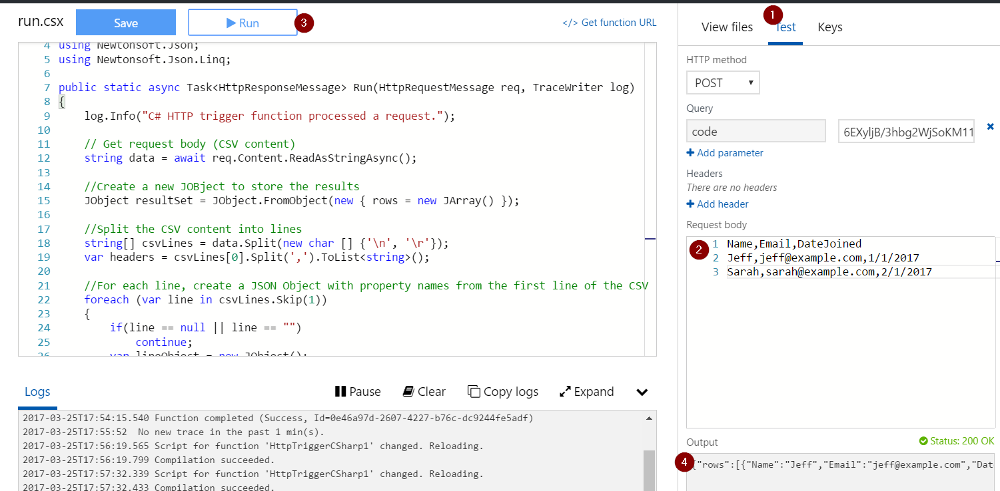
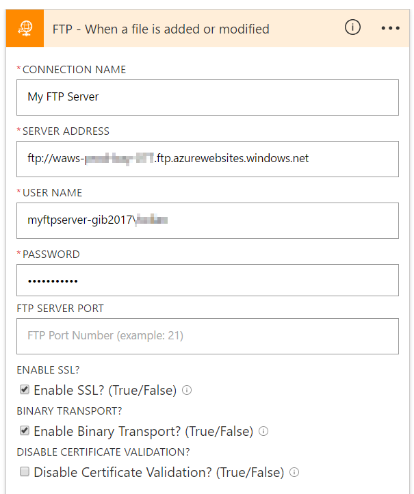
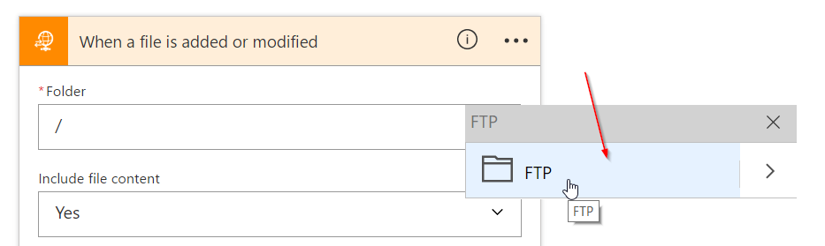
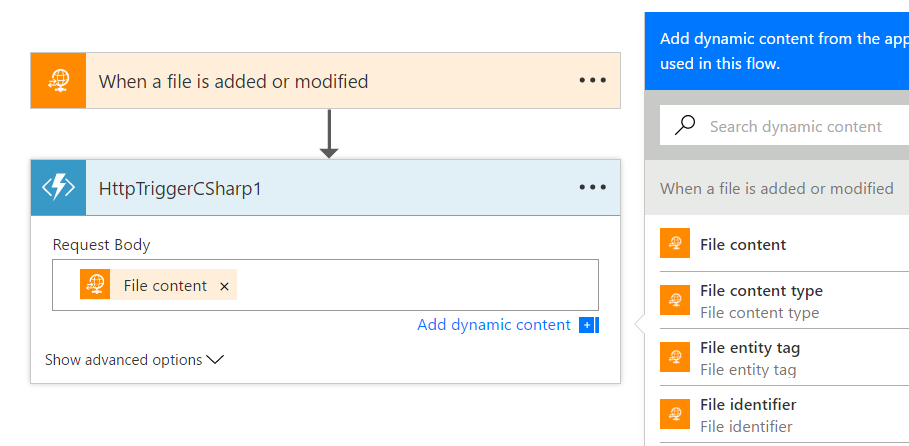
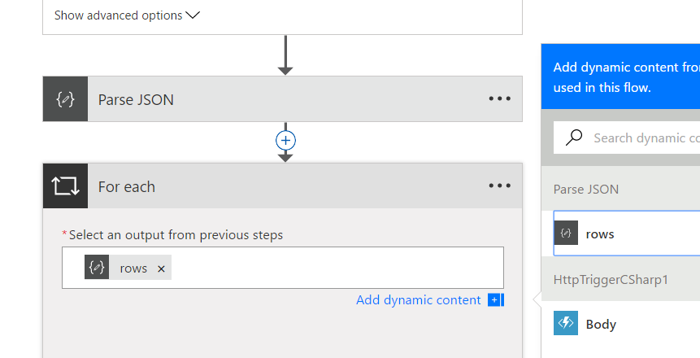
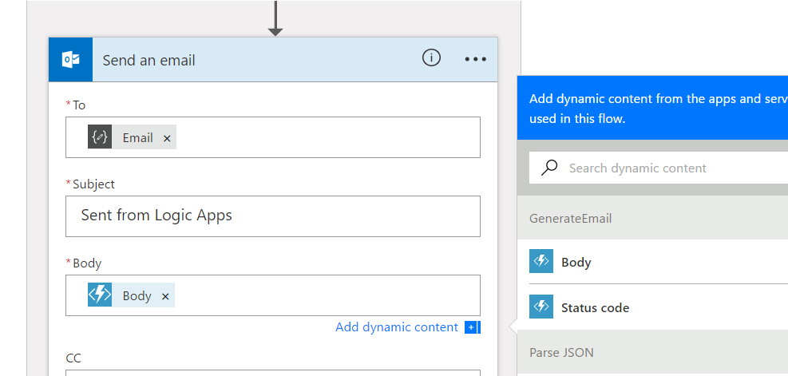

# Serverless Email Lab

In this lab, we will go through creating a serverless app.  In this case, we have a simple CSV we are uploading to an FTP Server.  We want to send an email to each of the customers listed in the CSV.  This lab will walk you though building a serverless app with Azure Functions and Azure Logic Apps.

You can see a video walkthrough of this scenario end-to-end here: [http://aka.ms/logicapps-serverless](http://aka.ms/logicapps-serverless)

## Prerequisited

1. An Azure Account - you can sign up for a free trial
1. An email account to Outlook.com, Office 365, or Gmail.com

## Setting up the FTP Server

If you already have an FTP server you can skip this part.  If not - here's how to get one easily with Azure App Services.

1. Go to the [Azure Portal](https://portal.azure.com) and sign in to your subscription
1. Click on the **New** button to create a new resource
1. Under **Web + Mobile** select to create a new **Web App**
    * Configure the website with whatever settings you want, and click **Ok** to create
    * It may be a good idea to select **Pin to my Dashboard** so it's easily accessible throughout this tutorial
1. After your web app is deployed, open it and select the **Deployment credentials** setting
1. Set the username/password to use for access to the FTP server
1. Go back to the **Overview** and copy the **FTP/deployment username** and **FTP hostname** - this is now your FTP server to upload the CSV

## Writing our Azure Functions

### CSV to JSON Azure Function

Now that we have an FTP server to drop a [CSV](./example.csv), we need to write some Azure Functions to do two things:

1. We need a Function to convert the CSV into a parsable format like JSON so we can iterate easily over each row and grab properties
1. We want to generate a rich HTML email, so will use a seperate function for that

To get started, go back to your [Azure dashboard](https://portal.azure.com) and select to create a new Function App:

1. Go to the [Azure Portal](https://portal.azure.com) and sign into your subscription
1. Click on the **New** button to create a new resource
1. Under **Compute** select **Function App**
1. Fill in the settings for your app, and click **Ok** to deploy
    * It may be a good idea to **Pin to my Dashboard** so it's easily accessible throughout this tutorial
    * NOTE: If creating in the same resource group as your FTP server - use the App Service Plan from the FTP setup for **Hosting Plan**
1. After your Function has deployed, open it and select **Webhook + API**
1. Choose **C#** and click **Create this function** to create a function

    You'll notice a simple example has been created.  This function can be called at anytime via the Function URL to invoke and compute.  In this case, we've already written some simple code to convert CSV to JSON.  You can [find it here](./csvfunction.csx) - feel free to copy and replace the code.

7. Save it, and open the **Test** tab - paste in the contents of the [CSV Example](./example.csv) and **Run**

    You should see the function processed the CSV, and returned a JSON representation of the CSV
    
    

### Generate Rich Email Function

Now that we have the customers we want to send emails to as JSON - we need to write our second function to generate the HTML body.  In this case we will send in a single `row` and generate an email for that customer.  For example if the Function recieved

``` json
{"Name":"Jeff", "Email":"jeff@example.com", "DateJoined":"1/1/2017"}
```

It would generate: `<body><p>Hello Jeff<br/>Thank you for signing up on 1/1/2017</p></body>`

1. In the same Function app as above, click **New Function**
    * You'll notice a number of different templates you can choose from.  To call a Function from a logic app, it needs to be either **Generic Webhook** or **HTTPTrigger** - the language doesn't matter
1. In this case we will write a function in javascript, so choose **Generic Webhook - Javascript** as the template
1. Name it whatever you want (something like `GenerateEmail`) and click **Create**
1. Paste in the code from [this javascript function](./emailfunction.js)
1. Save and run it with the JSON example below.  You'll notice it generates a valid HTML email
        
``` json
{"Name":"Jeff", "Email":"jeff@example.com", "DateJoined":"1/1/2017"}
```

## Orchestrating and integrating with Logic Apps

Now that we have our compute Functions written, we need to orchestrate and connect them with our FTP and email services.  This is very easy with Azure Logic Apps.

### Creating the Logic App

1. Click **New** in the Azure Portal to create a new resource
1. Under **Enterprise Integration** choose **Logic App**
1. Give it a name, resource group, and click **OK** to create
    * You may want to **Pin to Dashboard** for easy access
1. After the Logic App is deployed, open it to see the designer
    * This is the template screen - you could choose from a common template or trigger.
1. Click **Blank Logic App** to start from blank
1. You'll see the list of triggers - choose **FTP** to trigger on an FTP file
1. Select the **When a file is added or modified** trigger
1. It will now prompt for connection information for your FTP server.  This information is encrypted and stored to use whenever it runs.  Provide the FTP information from your FTP server

    

1. Once your connection is created - you can select a folder to listen to.  Just select the root directory
    
1. Choose a recurrence for how frequently to check the FTP Server for new files.  Since this is a tutorial let's keep it low and will manually trigger when needed.  Set this to 5 minutes.

    Now we need to add in our Azure Function to parse the CSV file after it's added

1. Click **New Step**, **Add an Action**, and choose **Azure Functions** -> **Choose an Azure Function**
1. Select the Function App created above
1. Select the C# CSV function above (defaults to name **HttpTriggerCSharp1**)
1. Pass in the **File Content** to the Request Body

    

    Now the Azure Function will return 3 things - a response Body, response Headers, and a response Status Code.  However, we know the response Body will be a JSON object with a few properties we are expecting.  There are a few ways to Parse JSON from Logic Apps, but for now let's just use the **Parse JSON** action to parse out the properties from the function.

1. Add a **New Step** and find the **Parse JSON** action
1. For the Content, pass in the Function Body.  Now we need to define a JSON Schema to parse.  We can choose **Generate from sample** at the bottom and generate from the output of our test run above (you can copy and paste from below)

    ``` json
    {"rows":[{"Name":"Jeff","Email":"jeff@example.com","DateJoined":"1/1/2017"},{"Name":"Sarah","Email":"sarah@example.com","DateJoined":"2/1/2017"}]}
    ```

    This will generate a valid schema for us.  

    Now we need to send an email **for each** row in the CSV.  For that we will add the for each loop.

1. Click **New Step**, **More**, and **Add For Each**
1. You'll notice the Parse JSON step generated a valid "rows" array.  You can add that to the foreach

    

1. Inside the foreach loop, add an action.  This will be our second Azure Function to generate an email for the current row.  Select **Azure Functions** and choose the javascript function written above.
1. For this request body - add the **rows - item** output.  This means it will send the current iterated item for "rows" -- or one of the row objects we tested above.
    * It's worth noting if you click the menu for the Function action, you can choose to open the Azure Function to view/modify/test it
1. Last but not least, we need to send an email now.  Add a **New Step** and send an email with either Outlook.com, Gmail, or Office 365 email connector
1. In the **to** field, choose the **Email** from our Parse JSON action.  In the **Subject**, enter a subject like "My email from Logic Apps", and in the **Body** select the output body of the second azure function (the HTML email).  
1. Be sure to open the **Advanced Settings** and choose **IsHTML** to **Yes**

    

1. Click save to publish the Logic App and have it start checking for FTP files.

That's it!  You now have a serverless app that will fire on a CSV file, process the CSV and send an email to each customer with a personalized email message.  

## Testing the Logic App

Create a CSV like the [example](./example.csv) -- but change the email address to one that you own so you can verify.  I usually test by dropping a file in with something like [FileZilla Client](https://filezilla-project.org/) - but use any FTP client you want.

1. Get your FTP client ready to drop your CSV file in
1. In the Logic App designer, click **Run**
    * This will poll every few seconds on the FTP server.  
    * **IMPORTANT NOTE** The FTP Server trigger works by adding new files based on the modified date/time.  FTP Server truncates seconds, so after dropping a file it can take up to a minute for the logic app to fire.  This way the logic app doesn't accidentally missed a file based on the truncated seconds.
1. Once the Logic App detects the file, you'll see the functions get called, the outputs generated, and the emails sent.

## What's Next?

In [part 2](https://channel9.msdn.com/Blogs/Microsoft-Integration/Build-and-Deploy-Serverless-Part-2) of the walkthrough above, you can also take this entire solution and turn it into a Visual Studio deployment project.  That means you can have a fully configured serverless app deployable into any region.  This could be checked into source control, or integrated in your CI/CD pipeline.

If you are intersted in more, be sure to check out our [monthly webcast](http://aka.ms/logicappslive) where we share the latest updates and what's coming next.